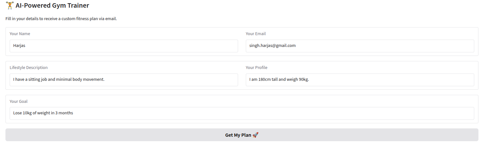
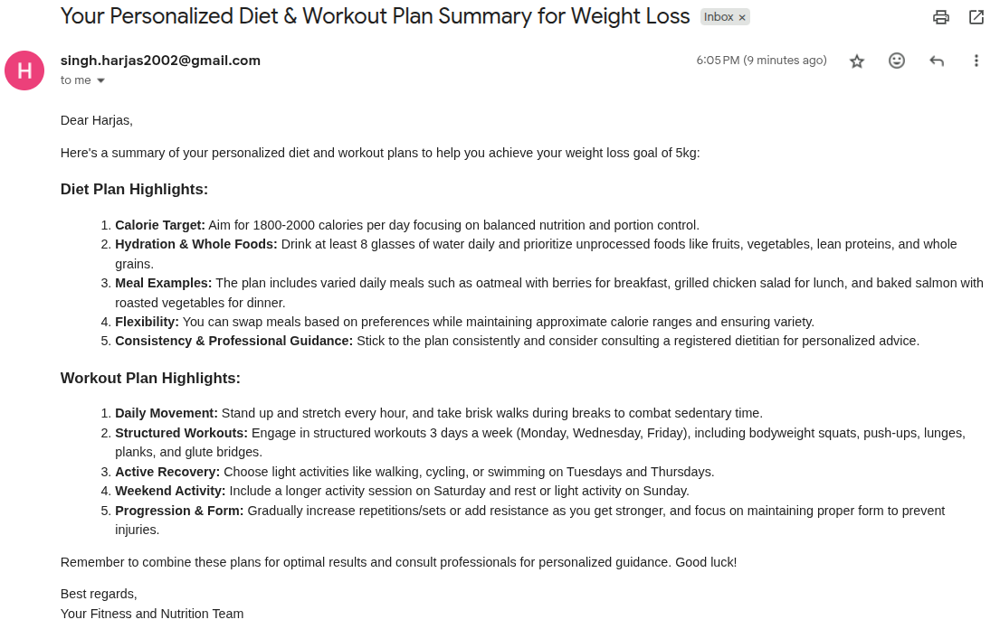

# GymTrainer Crew



Welcome to the GymTrainer Crew project, powered by [crewAI](https://crewai.com). This project is designed to help you set up a multi-agent AI system with ease, leveraging the powerful and flexible framework provided by crewAI. Our goal is to enable your agents to collaborate effectively on complex tasks, maximizing their collective intelligence and capabilities.

## Agents
We have the following agents
- exercise_planner - To create workout plan
- diet_planner - To create diet plan
- summariser - To summarize and generate email content in HTML
- notifier - To send off the email using custom tool


## Installation

Ensure you have Python >=3.10 <3.14 installed on your system. This project uses [UV](https://docs.astral.sh/uv/) for dependency management and package handling, offering a seamless setup and execution experience.

First, if you haven't already, install uv:

```bash
pip install uv
```

Next, navigate to your project directory and install the dependencies:

(Optional) Lock the dependencies and install them by using the CLI command:
```bash
crewai install
```
### Set up

**Add your follwoing keys into the `.env` file**
- GEMINI_API_KEY
- SMTP_SERVER
- SMTP_PORT
- SMTP_SENDER_EMAIL
- SMTP_PASSWORD

### Customizing
- Modify `src/gym_trainer/config/agents.yaml` to define your agents
- Modify `src/gym_trainer/config/tasks.yaml` to define your tasks
- Modify `src/gym_trainer/crew.py` to add your own logic, tools and specific args
- Modify `src/gym_trainer/main.py` to add custom inputs for your agents and tasks

## Running the Project

```bash
$ uv run gradio_ui
```

